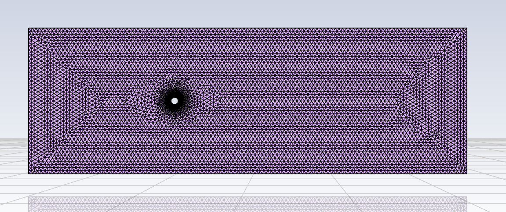
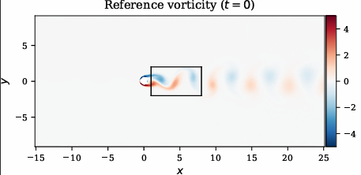
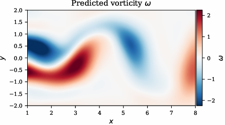
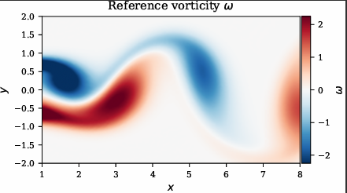
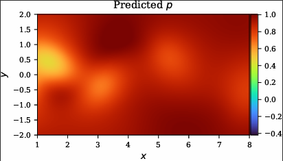
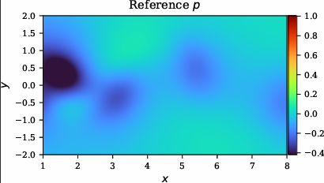

# Capstone Project: Physics-Informed Neural Networks for CFD

## Project Overview
This project explores how Physics-Informed Neural Networks (PINNs) can be used as a surrogate model for Computational Fluid Dynamics (CFD). Traditional CFD simulations are accurate but computationally expensive. This project investigates whether a PINN can learn fluid flow behavior by combining governing physics with limited data.

The focus of this project is 2D incompressible flow around a circular cylinder.

---

## Objective
- Model fluid flow using Navier–Stokes equations
- Train a PINN using sparse velocity data
- Estimate physical parameters (λ₁, λ₂)
- Compare predictions with reference CFD results

---

## Methodology

### CFD Setup
- Geometry: 2D cylinder in flow domain  
- Mesh generated using ANSYS tools  
- Flow data obtained from reference dataset (`cylinder_nektar_wake.mat`)  

### PINN Model
- Input: (t, x, y)  
- Output: velocity (u, v) and pressure (p)  
- Feedforward neural network  

To enforce incompressibility:
- u = ψ_y  
- v = -ψ_x  

---

### Physics Integration
The Navier–Stokes equations are embedded into the loss function using automatic differentiation.

Loss function:
- Data loss (velocity)
- Physics loss (Navier–Stokes residuals)

---

### Training
- Framework: TensorFlow 2  
- Optimizer: L-BFGS  
- Sparse velocity data + collocation points  

---

## Results

### 🔹 Mesh Setup
This shows the computational domain and mesh used for the cylinder flow simulation.

---

### 🔹 Vorticity Comparison

Reference vorticity (ground truth CFD result):

S

Zoomed comparison of predicted vs reference vorticity:

**Predicted:**

**Reference:**

✔ The model successfully captures the vortex shedding pattern behind the cylinder  
✔ Flow structures are learned well even with limited data  

---

### 🔹 Pressure Comparison

**Predicted Pressure:**

**Reference Pressure:**

⚠ Pressure prediction is less accurate  
- This is expected because pressure is not directly constrained by data  
- It is learned indirectly through the governing equations  

---

## Tools & Technologies
- Python  
- TensorFlow / Keras  
- NumPy, Matplotlib  
- h5py  
- ANSYS Fluent  
- ANSYS Discovery

---

## Key Takeaways
- PINNs can learn fluid flow behavior using both physics and data  
- Velocity and vortex structures were captured effectively  
- Pressure prediction remains challenging  
- Demonstrates potential for faster CFD approximations  

---

## Limitations
- Only cylinder geometry was tested  
- Training time is still relatively long  
- Model performance depends on tuning  

---

## Future Work
- Extend to square and triangle geometries  
- Improve pressure prediction  
- Optimize training efficiency  

---

## How to Run
1. Clone repository  
2. Place dataset in `main/Data/`  
3. Run `main/continuous_time_identification (Navier-Stokes)/NavierStokes.ipynb`

---

## Notes
The code automatically resolves required directories (`Utilities/`, `main/Data/`) from the working directory.
